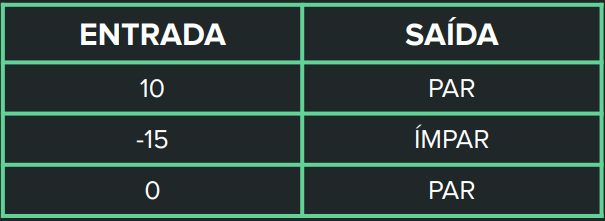
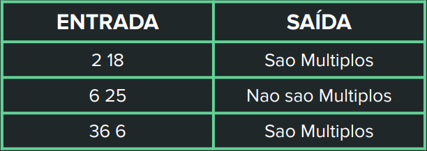
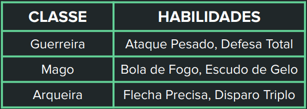

# Instruções

- Crie um repositório público no GitHub
chamado “Tarefas_LPR”. Sugiro
adicionar uma descrição desse
repositório no readme.md.
- Dentro do repositório “Tarefas_LPR”,
crie um diretório chamado “Aula4”.
Dentro dessa pasta você deve inserir os
códigos dos exercícios a seguir.

- São 3 exercícios. No enunciado de cada
exercício existe a indicação se ele deve
ser resolvido em C# ou C++

## Exercício 1 - C#

Fazer um programa para ler um número
inteiro, e depois dizer se este número é par
ou não.

## Exercício 2 - C++

Leia 2 valores inteiros (A e B). Após, o
programa deve mostrar uma mensagem
"Sao Multiplos" ou "Nao sao Multiplos",
indicando se os valores lidos são múltiplos
entre si. Atenção: os números podem ser
digitados em ordem crescente ou
decrescente.

## Exercício 3 - C#

Suponha que você está desenvolvendo um jogo
de RPG. Você é responsável por implementar a
mecânica de habilidades especiais para
diferentes classes de personagens. Cada classe
tem suas próprias habilidades especiais.
Crie um programa que permita ao jogador
escolher uma classe de personagem e, em
seguida, exiba suas habilidades especiais
correspondentes.

