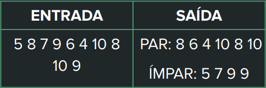
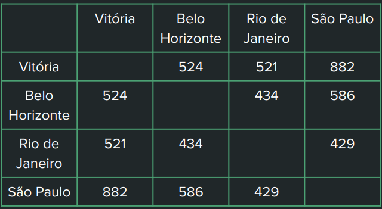
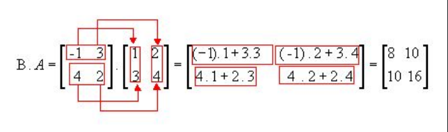

# Instruções

No seu repositório público no GitHub
“Tarefas_LPR”, crie uma pasta chamada
“Aula07”. Dentro dessa pasta você deve inserir
os códigos dos exercícios a seguir.
São 4 exercícios. Resolva 2 em C++ e 2 em C#.

## Exercício 1 - VETOR

Construa um algoritmo
que leia 10 números inteiros e armazene-os
em um vetor (use o for para fazer a leitura).
Depois, crie automaticamente dois
vetores, um contendo apenas os números
pares e outro os números ímpares
digitados.

## Exercício 2 - VETOR

Construa um algoritmo
que leia 10 números inteiros. Depois
solicite para o usuário um número que ele
gostaria de pesquisar no vetor. Caso o
número exista no vetor, mostre em qual
posição (ou quais) ele aparece e quantas
ocorrências foram detectadas.

## Exercício 3 - MATRIZ

A tabela a seguir
mostra a distância de quatro cidades entre
si. Por exemplo, a distância entre Vitória e
Belo Horizonte é de 524 km.

Crie um programa
que leia essa matriz e informe ao usuário a
distância entre duas cidades por ele
fornecidas.
O programa deve ficar repetindo até que o
usuário informe a mesma cidade como
origem e destino.

## Exercício 4 - MATRIZ

Crie um algoritmo que
leia duas matrizes A e B, de tamanho 3x3, e
calcule A*B. Dica abaixo:

