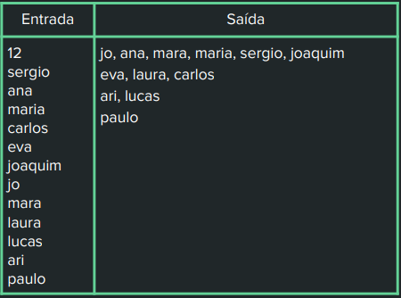

# Instruções

No seu repositório público no GitHub
“Tarefas_LPR”, crie uma pasta chamada
“Aula09”. Dentro dessa pasta você deve
inserir os códigos dos exercícios a seguir.
São 2 exercícios. 

## Exercício 1 - C#

Construa uma lista de X nomes aleatórios
A saída deve ser mostrada em uma ou
mais linhas. Cada linha tem uma lista de
nomes ordenados por tamanho,
começando com o menor. Em cada linha,
só pode ser mostrado um nome de
determinado tamanho, e os demais
nomes com o mesmo tamanho devem ser
apresentados nas linhas seguintes. Você
deve seguir a ordem de digitação.

Exemplo de Entrada e saída:

## Exercício 2 - C++

- Construa uma lista de 100 números
aleatórios
- Crie um algoritmo que coloque-os em
ordem crescente e imprima-os
- A partir dessa lista ordenada, remova
todos os números pares e imprima a lista
novamente.
- Por fim imprima quais números se
repetem, se existe algum número
repetido.